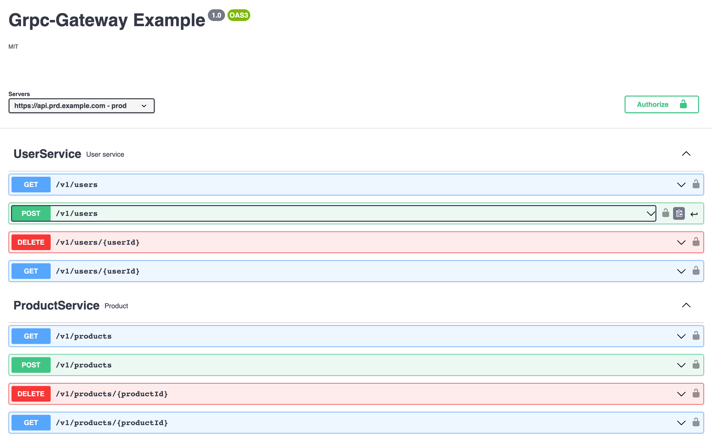

Introduction
============
In the realms of Google or Wix, everything revolves around microservices, especially gRPC ones. 
The simplicity of defining a service through a proto file and generating the necessary code from it brings forth 
language independence and reduces the initial overhead of setting up a service.

gRPC's implementations are often smoother than REST APIs, as they eliminate the need to deserialize URL parameters, 
headers, or the body of a request. This allows developers to immediately start implementing their services and use 
deserialized messages as input.

However, the gRPC protocol might not be well understood or favored by certain clients, particularly front-end 
applications. This is where a REST API endpoint can prove to be beneficial. The gRPC Gateway in Golang allows us to 
generate a REST API endpoint from our proto file, providing an optimal solution.

Furthermore, we can expose multiple microservices under the same domain as the gRPC Gateway acts like a reverse proxy.

This project showcases the use of gRPC and gRPC Gateway in Golang.

Generate Definitions
---------------
To generate the necessary protobuf and OpenAPI files, follow these steps:
1. Install protobuf compiler
    - `brew install protobuf`
    - `go install github.com/golang/protobuf/protoc-gen-go`
    - `go install github.com/grpc-ecosystem/grpc-gateway/v2/protoc-gen-openapiv2`
    - `go install github.com/grpc-ecosystem/grpc-gateway/v2/protoc-gen-grpc-gateway`
    - `go install github.com/grpc-ecosystem/grpc-gateway/protoc-gen-swagger`
    - `go install google.golang.org/grpc/cmd/protoc-gen-go-grpc`
2. Generate the protobuf files
    - `make proto`
3. Generate openapi yaml
   - `make openapi`

Getting Started
---------------
1. Start the server (with the binary or with air to achieve hotreload on code changes)
    - `make run`
    - `make hotreload`
2. Lint
    - `make lint`
3. Test
    - `make test`

Generated OpenAPI Documentation
---------------

